# Pseudo

Bao gồm các mục:

- **_`Pseudo Classes - Lớp Giả`_**
  - :root
  - :hover
  - :active
  - :first-child
  - :last-child
- **_`Pseudo Elements - Phần Tử Giả`_**
  - ::before
  - ::after
  - ::first-letter
  - ::first-line
  - ::selection

---

## II. Pseudo Elements - Phần Tử Giả

- ::before
- ::after
- ::first-letter
- ::first-line
- ::selection

Xem thêm ở [w3schools css Pseudo Elements](https://developer.mozilla.org/en-US/docs/Web/CSS/Pseudo-elements)

---

### ::before

- Sử dụng để tạo 1 đối tượng giả đứng trước đối tượng cần thêm.

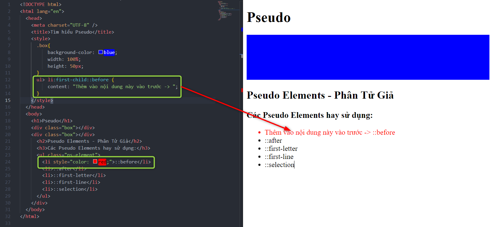
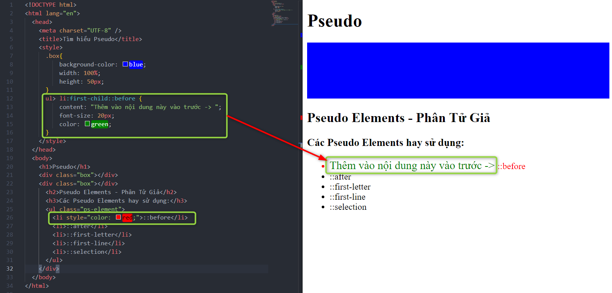
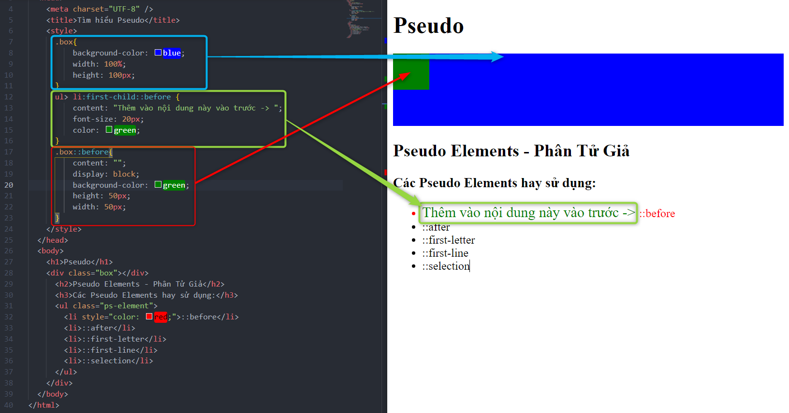

> Syntax : Muốn thêm 1 khối màu thì phải có Content = "" và Display : block.

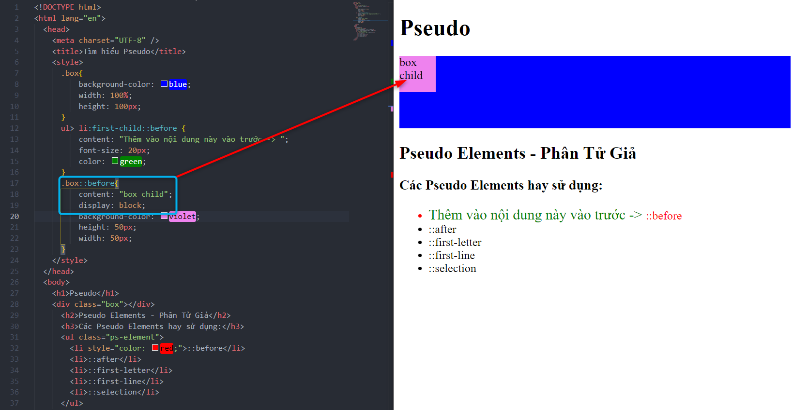

Xem thêm ở [w3schools css Pseudo ::before](https://developer.mozilla.org/en-US/docs/Web/CSS/::before)

---

### ::after

- Sử dụng để tạo 1 đối tượng giả đứng sau đối tượng cần thêm.
- Xem lại mục [CSS Function Attr()](../detail/css-function.md) có sử dụng điều chỉnh `Content`
- Tiếp theo mục `::before`, bây giờ sẽ thêm 1 block `::after` và kiểm tra vị trí `elements box` trên `Dev Tool`.

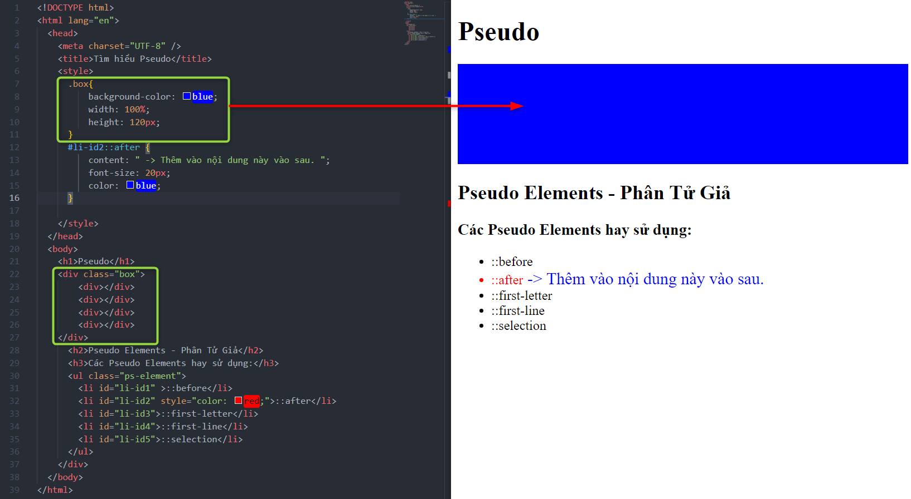
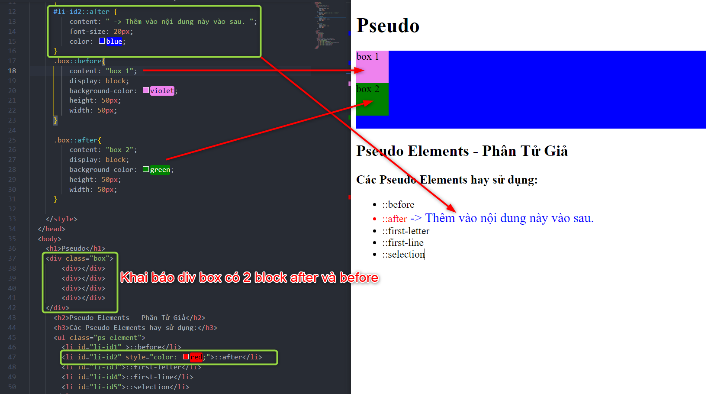
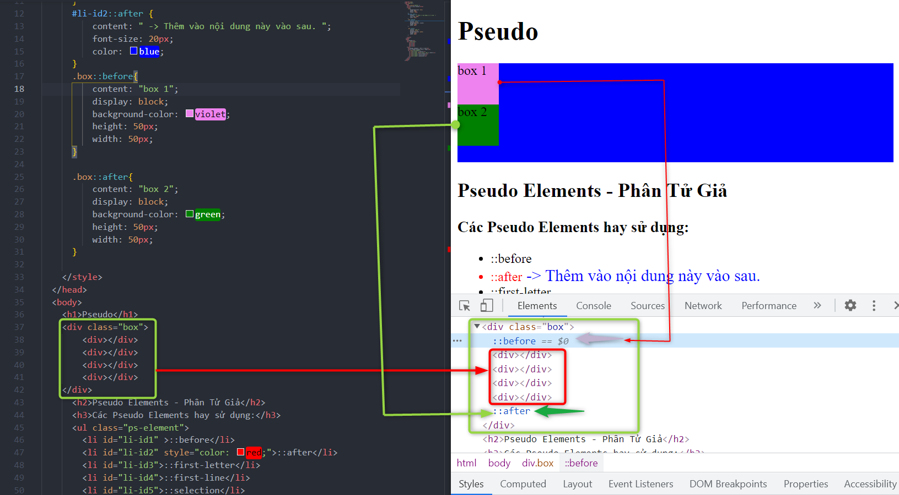

Xem thêm ở [w3schools css Pseudo ::after](https://developer.mozilla.org/en-US/docs/Web/CSS/::after)

---

### ::first-letter

- Lấy ký tự đầu của 1 đối tượng text.
- Thường sẽ lấy chữ cái viết hoa.

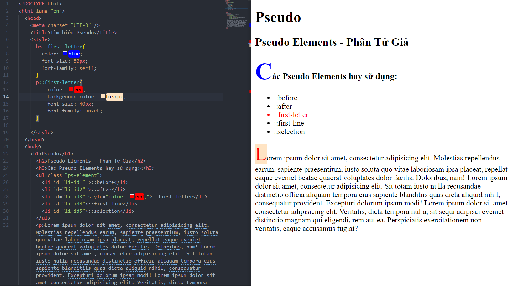
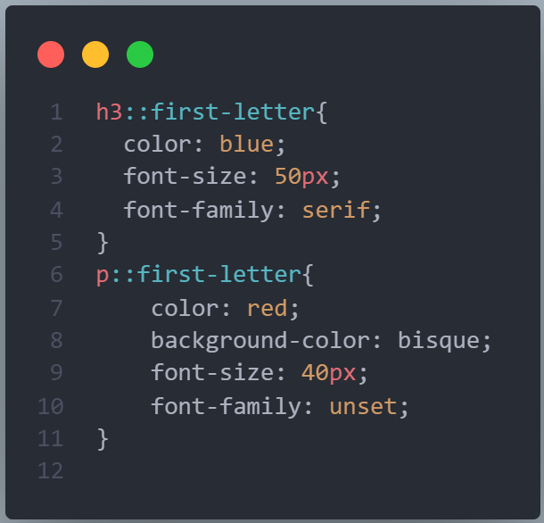

---

### ::first-line

- Sử dụng lấy dòng đầu tiên của Paragraph, khi co giãn vẫn lấy dòng đầu tiên hiển thị.

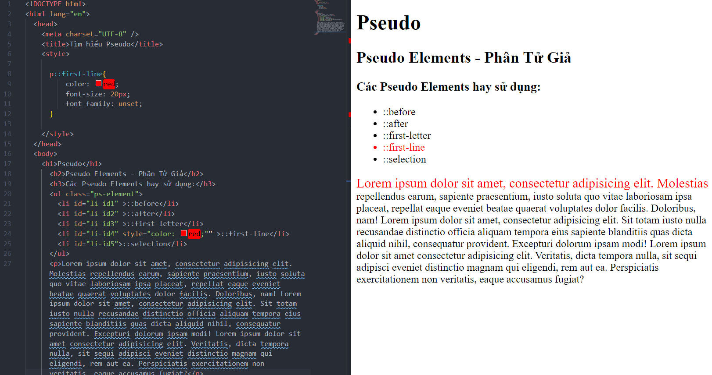
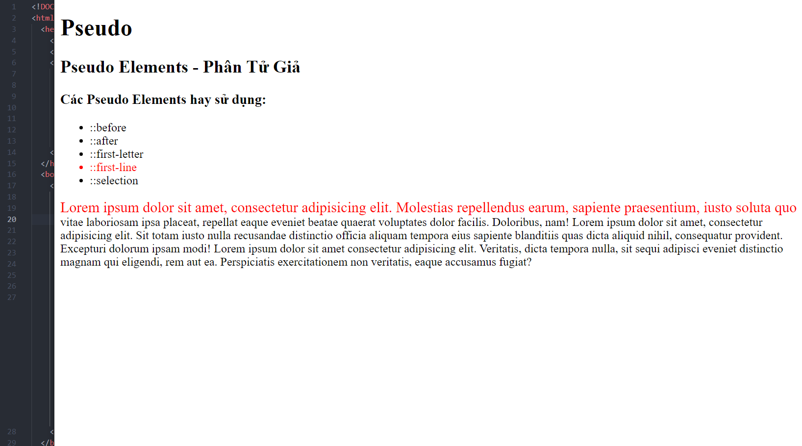

---

### ::selection

- Thuộc tính khi chọn hay bôi đen 1 đoạn, đối tượng nào đó.

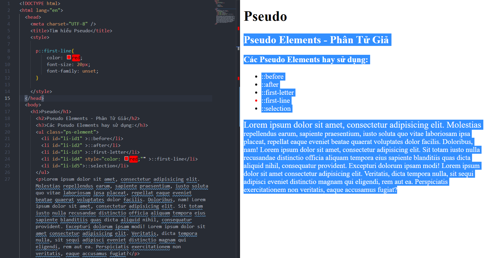
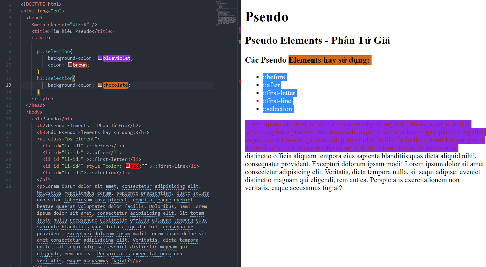

---
