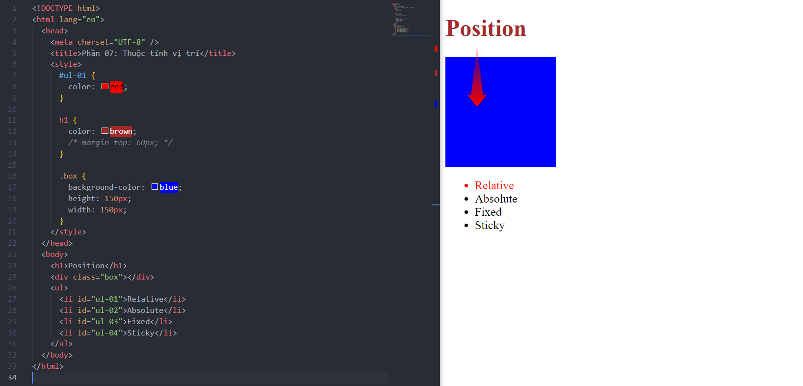
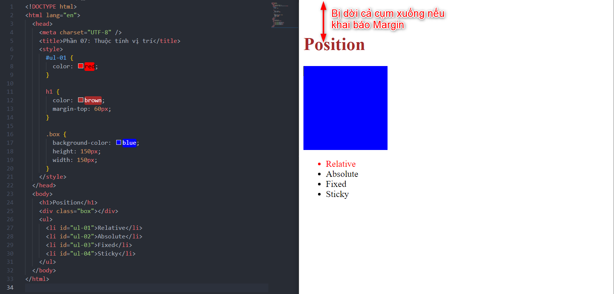
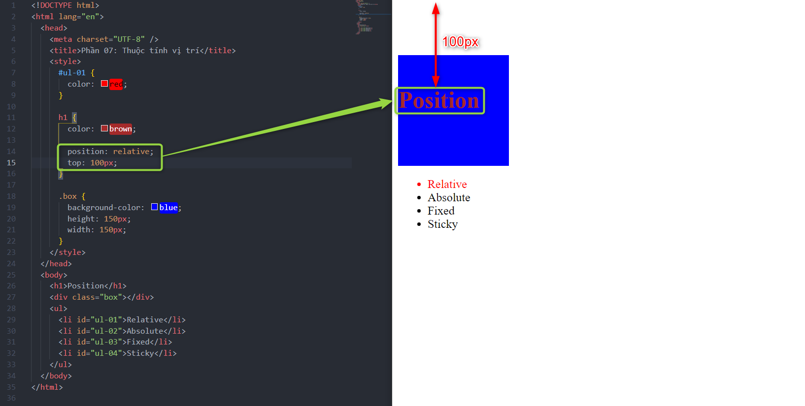
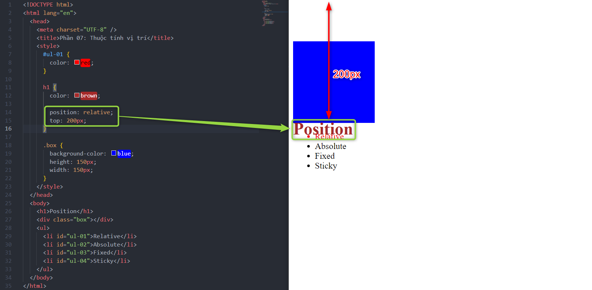
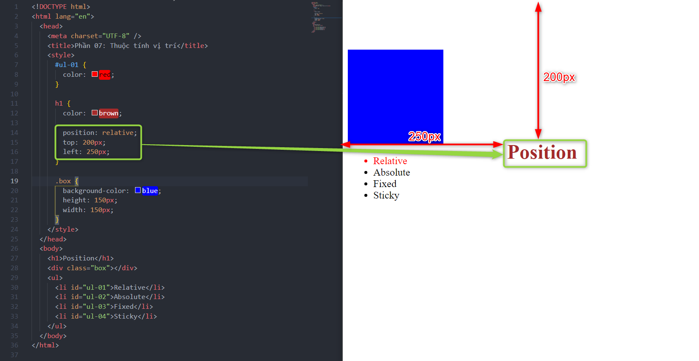

# Phần 07: Thuộc tính vị trí (Position)

Các khai báo về vị trí `Position`:

- Relative
- Absolute
- Fixed
- Sticky

---

## 1. Position Relative

- Vị trí tương đối của đối tượng.
- Nếu ta có vị trí bố trí như sau:

<!--  -->

> Yêu cầu: Di chuyển Position(h1) đè lên hình vuông Box.

- Nếu thay đổi margin thì sẽ bị đẩy cả cụm xuống dưới.

- Lúc này ta sử dụng `Position Relative` để không ảnh hưởng đến các `elements` khác.

<!--  -->

> Lưu ý: Nếu không có thuộc tính position thì sẽ không dùng được các thuộc tính (top, bottom, left, right).
