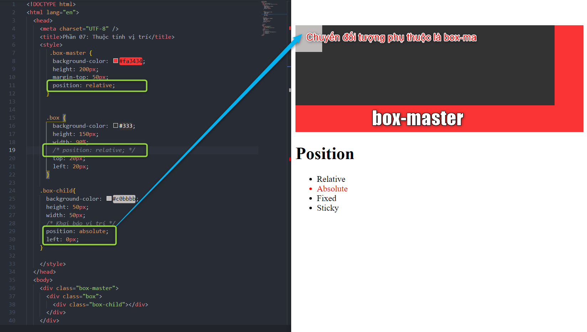
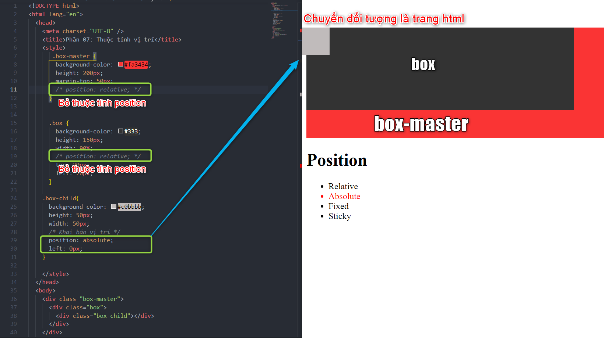
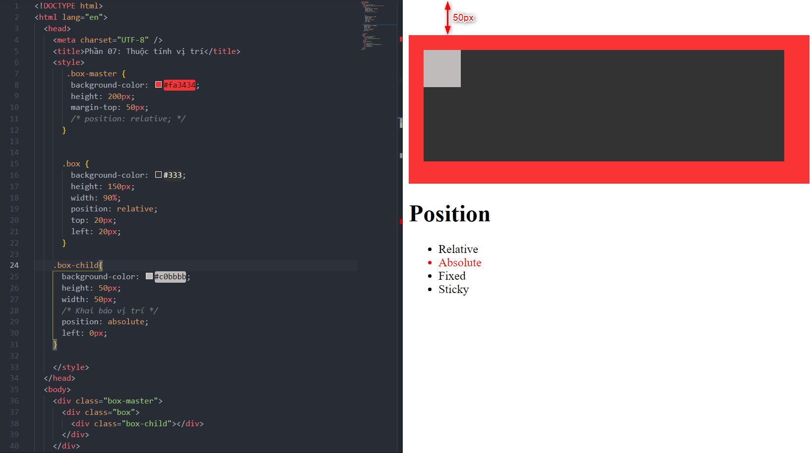
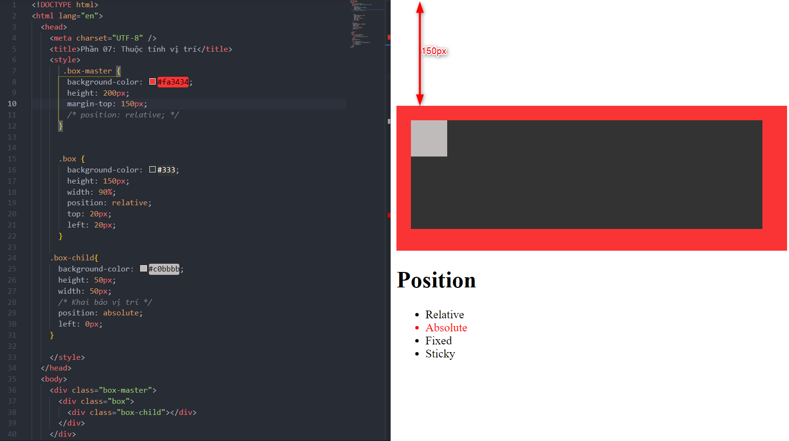
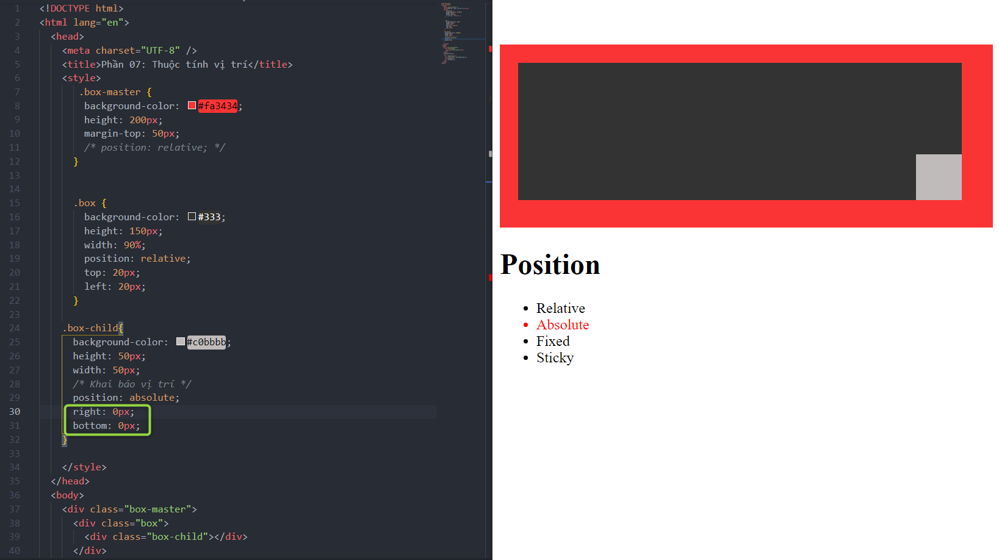
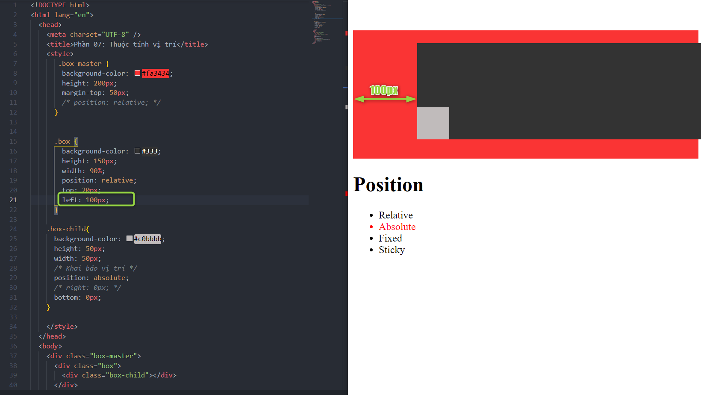
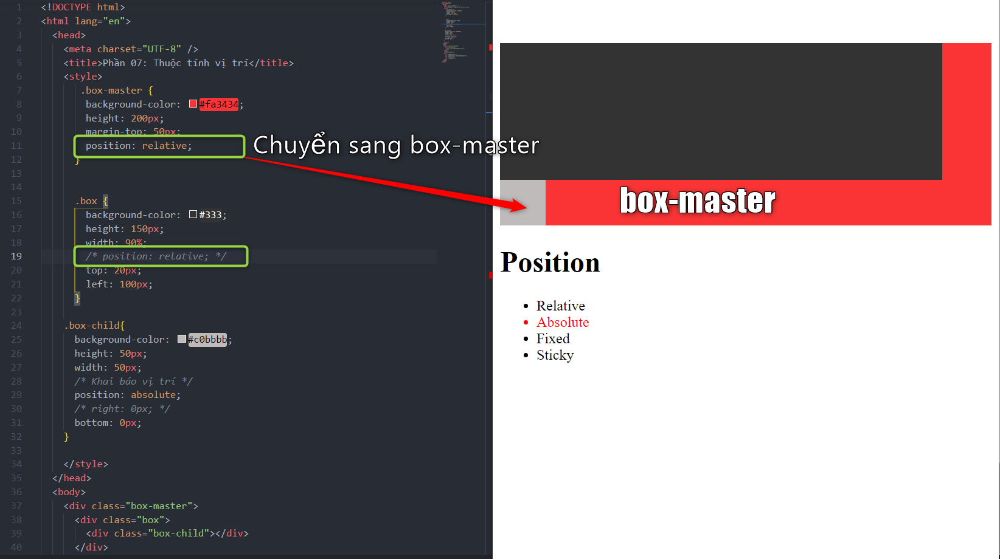
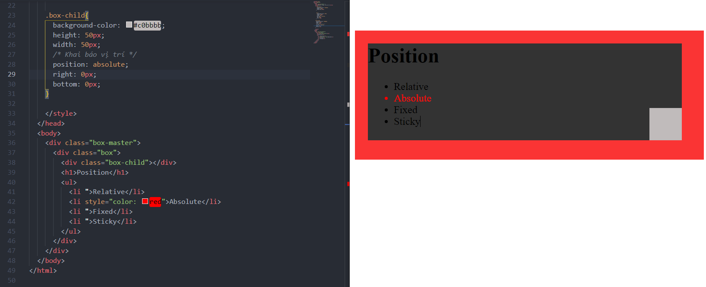
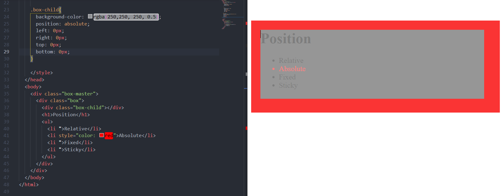

# Phần 07: Thuộc tính vị trí (Position)

Các khai báo về vị trí `Position`:

- Relative
- Absolute
- Fixed
- Sticky

---

## 2. Position Absolute

- Khi nhìn layout thấy 1 đối tượng là con `child` của 1 đối tượng khác.
- Muốn di chuyển đối tượng vị trí đối tượng con xung quanh đối tượng cha.
- Di chuyển đối tượng cha nhưng không làm thay đổi vị trí của đối tượng con trong cha thì dùng chức năng `Absolute`.
- Đối tượng con có thể tự do di chuyển trong đối tượng cha.
- Khi đối tượng được khai báo `Absolute` sẽ tìm cấp cao hơn chứa thuộc tính `position` để làm trục tọa độ để sử dụng (top,bottom, left, right). Nếu không thấy sẽ căn cứ vào trình duyệt.

- Thẻ con có position `Absolute` sẽ tìm theo từng cấp thẻ cha bên ngoài bao bọc thẻ con đó xem có thẻ nào có thuộc tính position để làm góc tọa độ.

- Ứng dụng: Tạo lớp layout overlay phủ lên toàn bộ trang.

