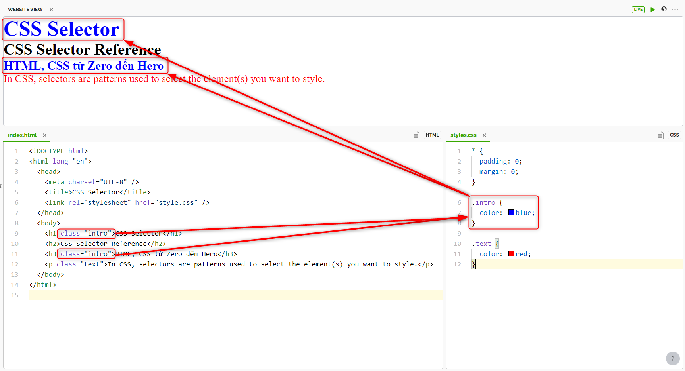

# CSS Selector

---

## 1. Chọn .class

Chọn các thẻ `.intro`

```
- Selector: .class
- Ví dụ: .intro
- Mô tả: Chọn tất cả các thẻ có class=`intro`
```



## 2. Chọn .class1.class2

Chọn tất cả các thẻ có cả `name1` và `name2` được đặt trong thuộc tính class của nó.

```
- Selector: .class1.class2
- Ví dụ: .name1.name2
- Mô tả: Chọn tất cả các thẻ có cả name1 và name2 được đặt trong thuộc tính class của nó
```


## 3 Chọn .class1 .class2

- Có khoảng cách giữa `.class1` và `.class2`
- Chọn tất cả các thẻ có `class=“name2”` là con của một phần tử có `class=“name1”`

```
- Selector: .class1 .class2
- Ví dụ: .name1 .name2
- Mô tả: Chọn tất cả các thẻ có class=“name2” là con của một phần tử có class=“name1”
```


## 4. Selector: \*

Chọn tất cả các thẻ. Tất cả đều cùng 1 font size là 20px.

```
- Selector: *
- Ví dụ: *
- Mô tả: Chọn tất cả các thẻ
```


