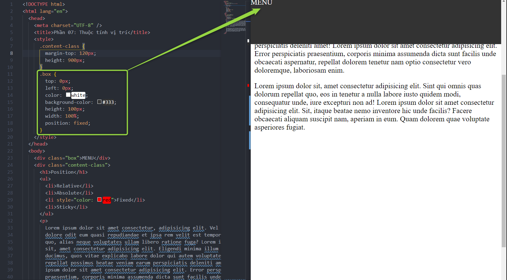

# Phần 07: Thuộc tính vị trí (Position)

Các khai báo về vị trí `Position`:

- Relative
- Absolute
- Fixed
- Sticky

---

## 4. Position Sticky

- Thuộc tính này giúp cố định đối tượng 1 vị trí nào đó, ghim(pin) đổi tượng.
- Ứng dụng cho các Header kéo xuống vẫn giữ nguyên ở đầu.

---
