# CSS Functions

Một số hàm hay sử dụng trong CSS để khai báo.

- :root
- var()
- linear-gradient()
- rgba()
- rgb()
- calc()
- attr()

---

## Biến giả - :root

- Biến global và biến local
- Sử dụng biến `variable` sẽ hỗ trợ việc gán linh hoạt các đặc tính của các phần tử.
- Khi khai báo các đặc tính của phần tử `element` thay vì khai báo trực tiếp, sẽ sử dụng gán bằng giá trị của biến `variable` đã khai báo sẵn.
- Muốn thay đổi đặc tính của `element` thay vì phải sửa từng vị trí khai báo thì chỉ cần khai báo lại đặc tính của biến `variable` được gán ở 1 nơi.

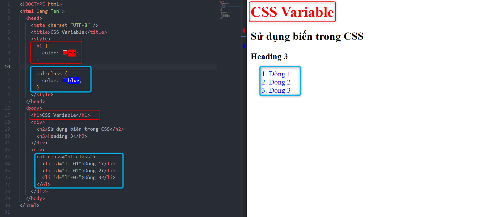

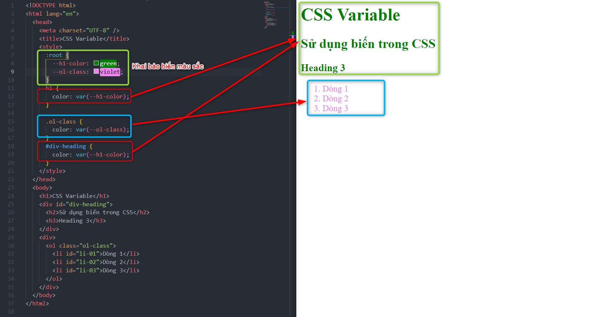
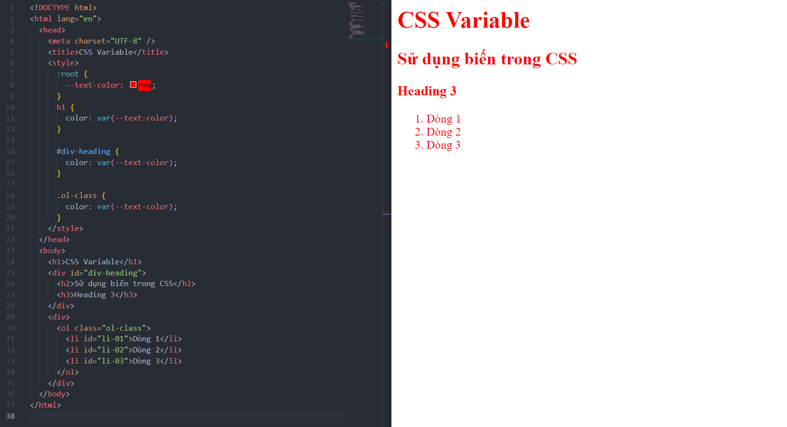
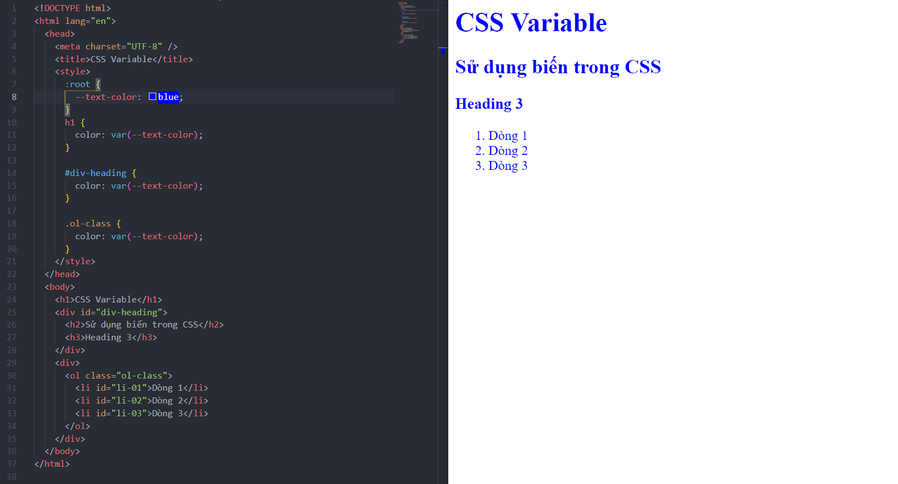

---

### Biến global

- Biến được khai báo ở `:root` được gọi là biến `Global`.

### Biến local

- Biến được khai báo trong 1 đối tượng nào đó sẽ là biến `Local`, một đối tượng sẽ được ưu tiên theo biến `Local` hơn so với biến `Global` khi được khai báo có biến `Local` được đặt cùng tên biến `Global`.

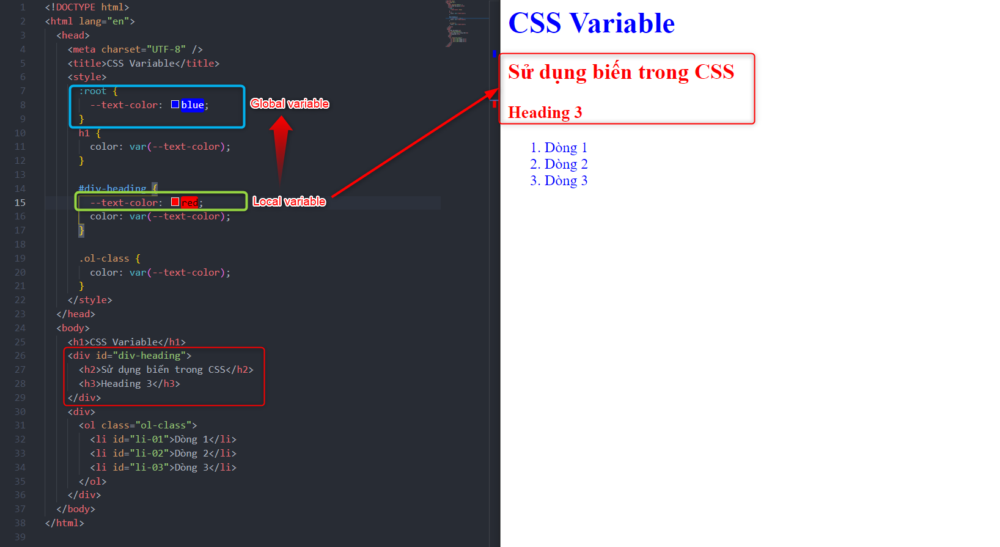

---

- Để tiện đồng bộ theme về màu sắc, font chữ và cũng như tránh việc khi có sự thay đổi phải sửa lại nhiều nơi sẽ mất nhiều thời gian và đôi khi thiếu xót -> Ta nên sử dụng biến giả nếu cần thiết kế khi có 1 nhóm các đối tượng cần đồng nhất.

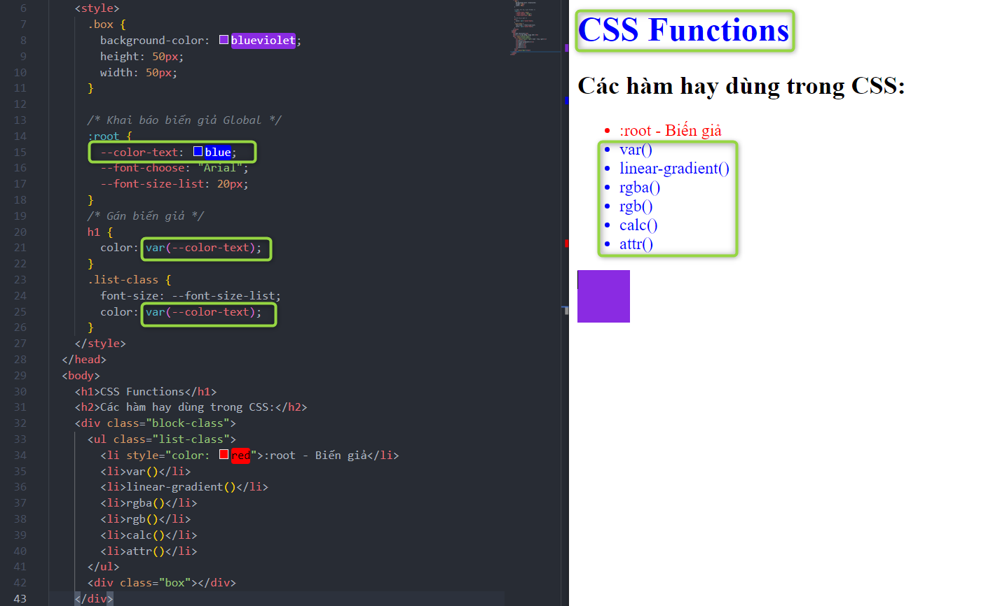
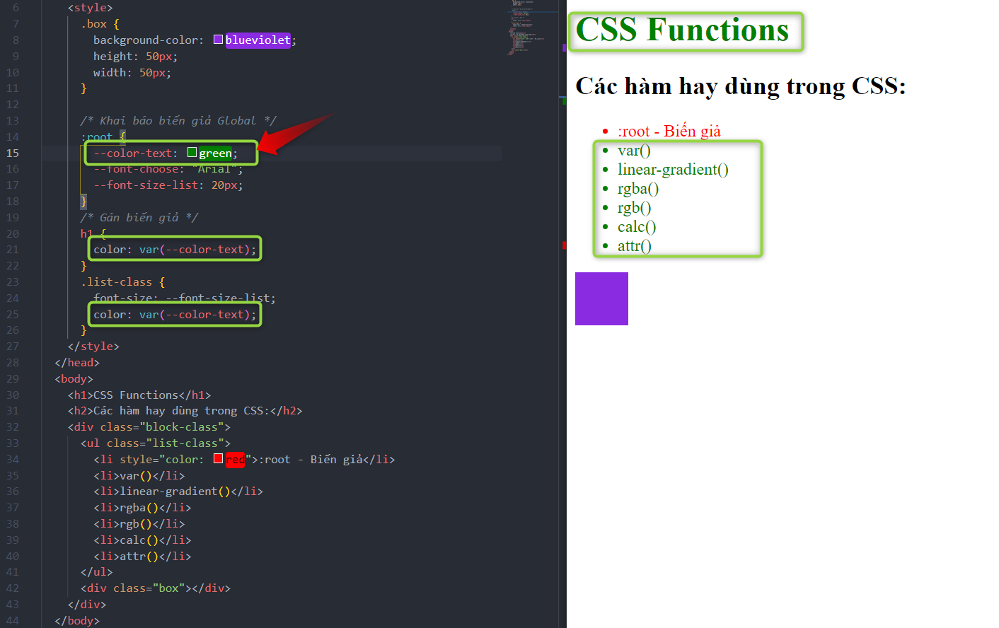
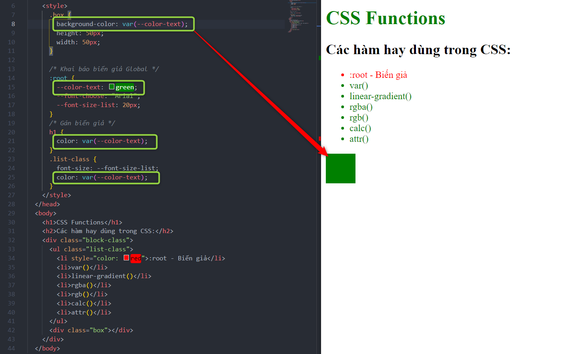
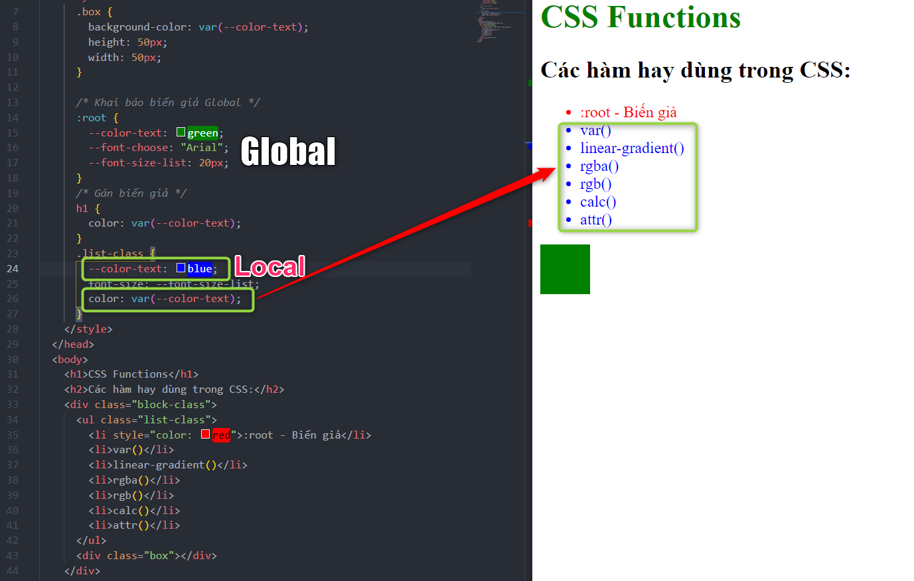

- Khi khối block có 2 biến giả Global và Local cùng tên, thì sẽ ưu tiên biến Local cho khối block đó -> Trong khối Block thì biến giả Local sẽ được ưu tiên hơn.

- Biến local chỉ có tác dụng trong khối block được khai báo, không có tác dụng ngoài khối block.

Xem thêm ở [w3schools css variable](https://developer.mozilla.org/en-US/docs/Web/CSS/Using_CSS_custom_properties)

## Var - Hàm để sử dụng biến giả

- Sau khi khai báo biến giả Global hay Local, muốn sử dụng được biến giả đó gán cho một thuộc tính đối tượng thì cần hàm Var.

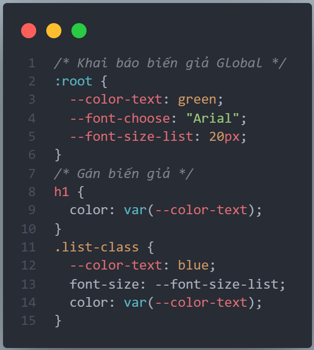

Xem thêm ở [w3schools css Var()](<https://developer.mozilla.org/en-US/docs/Web/CSS/var()>)

---

## linear-gradient()

- Hàm sử dụng tạo dải màu liên tục thay vì solid 1 màu.
- Áp dụng background thay vì hay dùng background-color

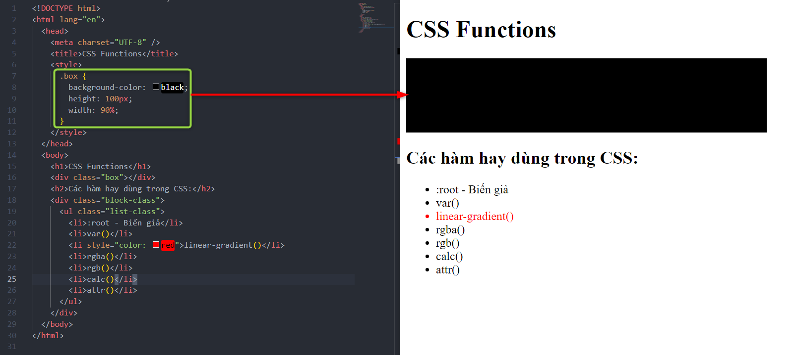
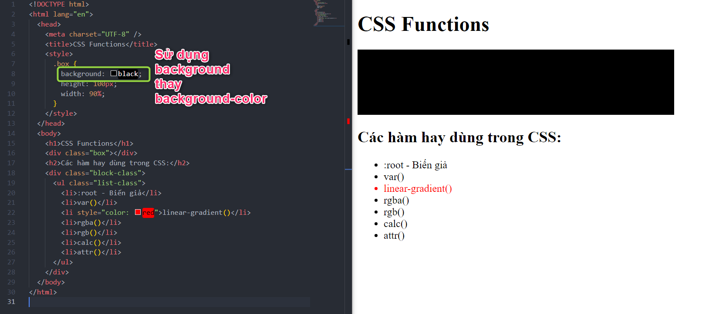
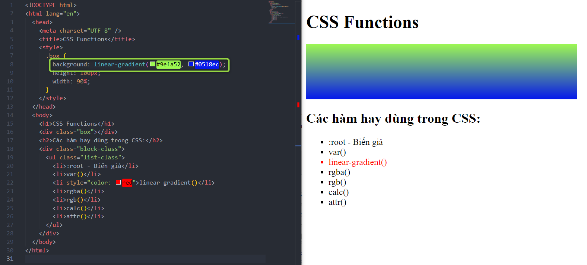

- Có thể thêm tham số gốc để xoay trục gradient.

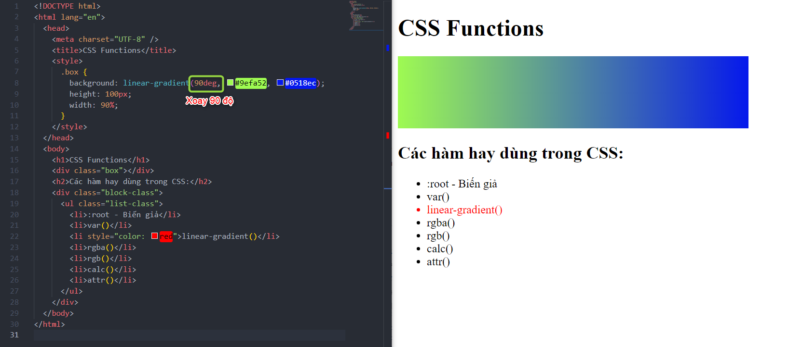

Xem thêm ở [w3schools css linear-gradient()](<https://developer.mozilla.org/en-US/docs/Web/CSS/gradient/linear-gradient()>)

---

## rgba() - Màu trong suốt

- Đây là hàm có khả năng khai báo màu sắc có khả năng điều chỉnh độ trong suốt có thể nhìn xuyên qua.

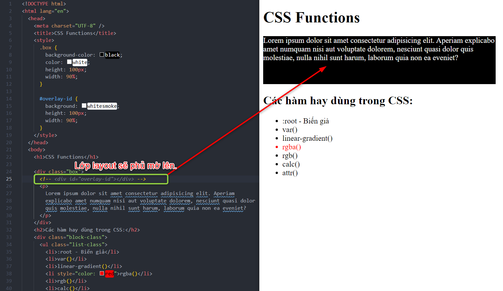
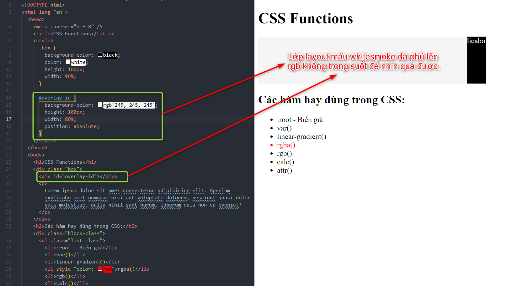

- Dùng hàm rgba thay vì rgb để có thể chuyển sang trong suốt.

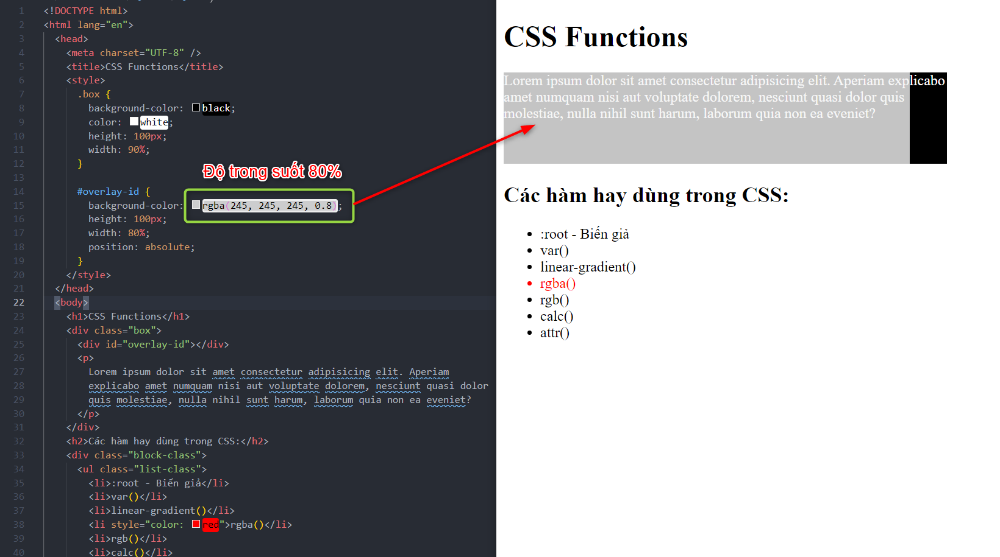
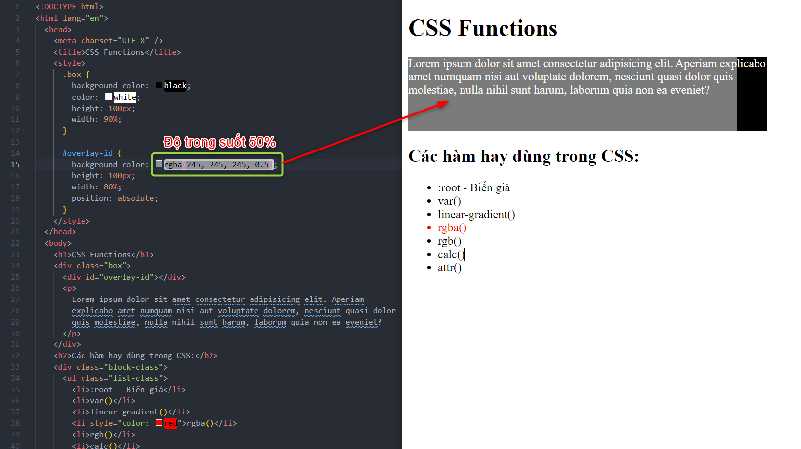

Xem thêm ở [w3schools css rgba()](<https://developer.mozilla.org/en-US/docs/Web/CSS/color_value/rgba()>)

---

## rgb() - Màu đơn sắc

- Tương tự như hàm rgb truyền vào 3 tham số màu `red` - `green` - `blue`

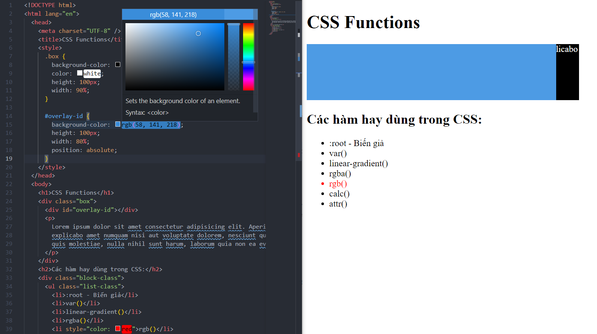

## calc() - Hàm tính toán

- Thường sử dụng để tính kích thước cho đối tượng.

 1")
 2")

Xem thêm ở [w3schools css calc()](<https://developer.mozilla.org/en-US/docs/Web/CSS/calc()>)

---

## attr() - Hàm lấy thuộc tính attribute của đối tượng

- Sử dụng cùng với các `Pseudo` để áp dụng lấy các thuộc tính của đối tượng để xử lý.

 1")
 2")
 3")

Xem thêm ở [w3schools css attr()](<https://developer.mozilla.org/en-US/docs/Web/CSS/attr()>)
