# Priority - Ưu tiên CSS

Cấp độ ưu tiên trong CSS khi gán Style:

- Internal, External ?
- tag - 1
- .class - 10
- #id - 100
- Inline - 1000
- Equal specificity
- Universal selector or inherited

---

## Nội dung

Phần này sẽ liên quan đến việc CSS gán style cho các thẻ, đối tượng elements trong html dựa trên các mức độ ưu tiên nếu cùng 1 đối tượng được khai báo cùng lúc bằng nhiều cách.

---

### 1. Internal, External (Khai báo trong hay khai báo file ngoài)

- `Internal` : Khi sử dụng khai báo CSS bằng style trong file html.

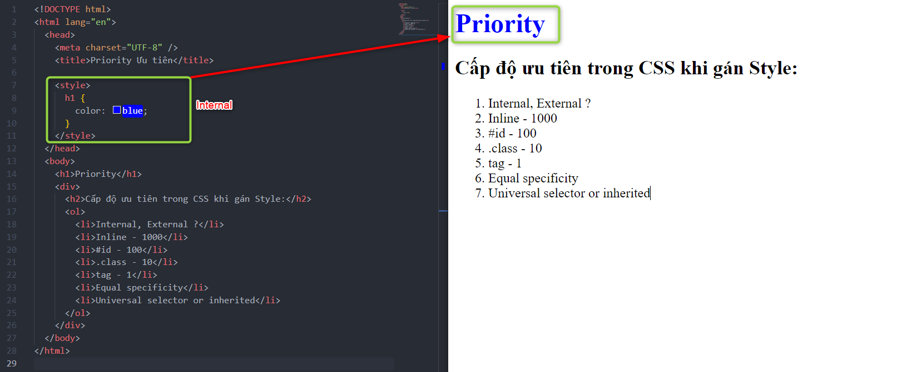

- `External` : Khi sử dụng khai báo CSS thông qua 1 file style link từ bên ngoài vào file html.

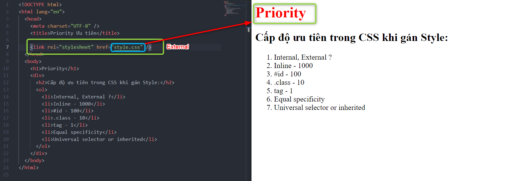

> file style.css được khai báo ở ngoài file index.html và được link vào.

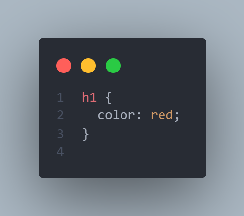

```css
h1 {
  color: red;
}
```

- Vậy việc ưu tiên khai báo nào sẽ được ưu tiên hơn giữa `Internal` - Khai báo ngay ở trong file và `External`- Khai báo liên kết từ file ngoài ???

- Vị trí ưu tiên cùng 1 đối tượng `element` sẽ được ưu tiên dựa trên vị trí đặt của `Internal` hay `External` theo thứ tự sắp xếp, khai báo được gọi sau cùng sẽ được ưu tiên hơn.

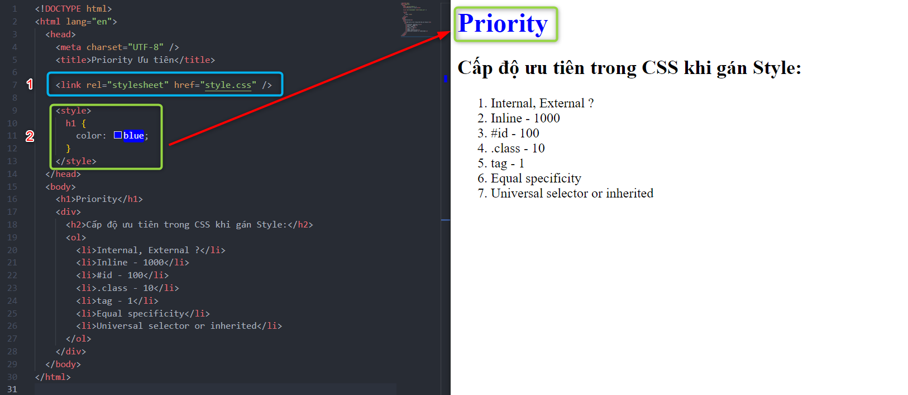
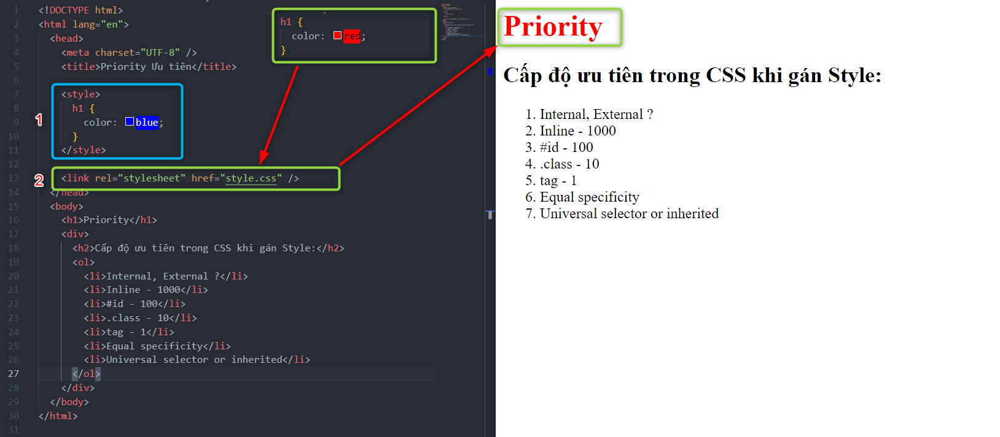
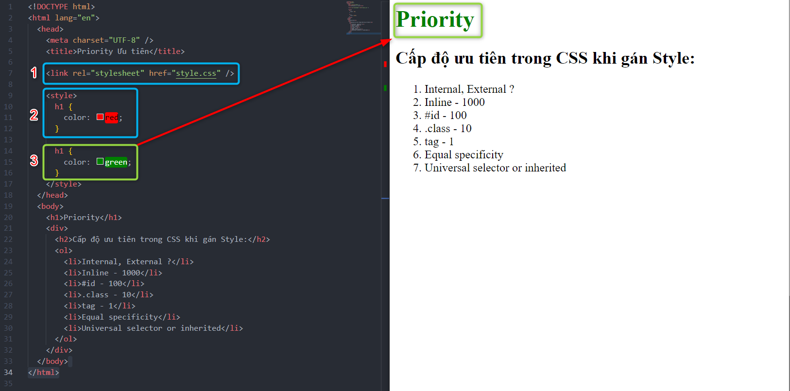

> Thẻ h1 được khai báo ở vị trí 3 cuối cùng sẽ được ưu tiên.

### 2. Tag (Khai báo theo thẻ)

- Nếu khai báo cùng 1 đối tượng element nằm sau cùng sẽ được ưu tiên hơn.

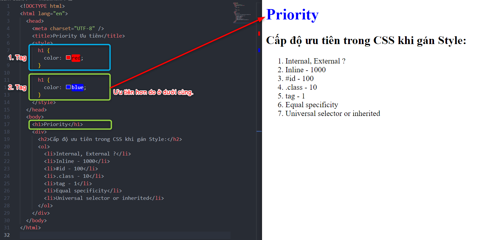

### 3. Class (Khai báo lớp .class)

- Nếu cùng một đối tượng được khai báo, mức độ ưu tiên sẽ theo thứ tự sắp xếp của điểm số tăng dần như sau:
  - tag - 1
  - .class - 10
  - #id - 100
  - Inline - 1000

> Nếu đối tượng h1 được khai báo thẻ h1 và được khai báo theo lớp .class thì lớp class sẽ được ưu tiên hơn mặc dù khai báo .class nằm ở trên.

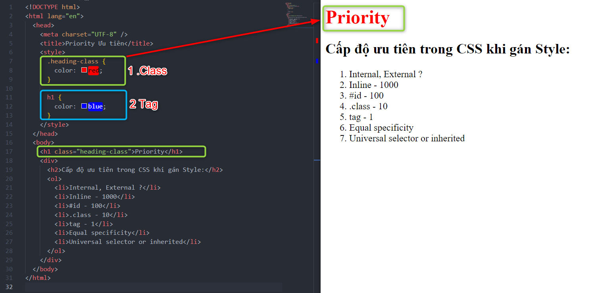

### 4. ID (Khai báo theo id)

- Khai báo bằng ID sẽ được ưu tiên hơn so với khai báo bằng Class và Tag theo thứ tự: `ID > Class > Tag`

> **_Ví dụ :_**
> Nếu đối tượng `Priority` có thẻ `h1`. Có `class` = "heading-class" và có `ID` = "heading-id". Thì khai báo ID sẽ được ưu tiên hơn mặc dù vị trí khai báo ở đầu tiên.

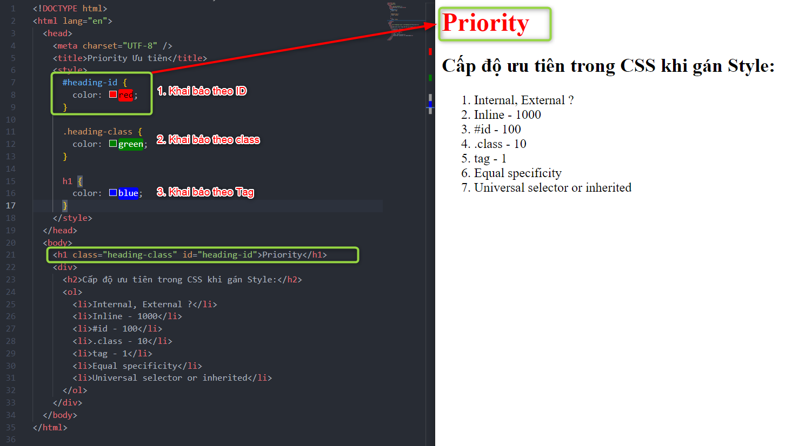

### 5. Inline (Khai báo style bên trong đối tượng)

- Khai báo Inline bên trong đối tượng sẽ được ưu tiên hơn so với các khai báo khác theo thứ tự như sau: `Inline > ID > Class > Tag`

> **_Ví dụ :_**
> Nếu đối tượng `Priority` có thẻ `h1`. Có `class` = "heading-class" và có `ID` = "heading-id". Và có thêm khai báo Inline ở trong. Thì sẽ dựa trên khai báo Inline.

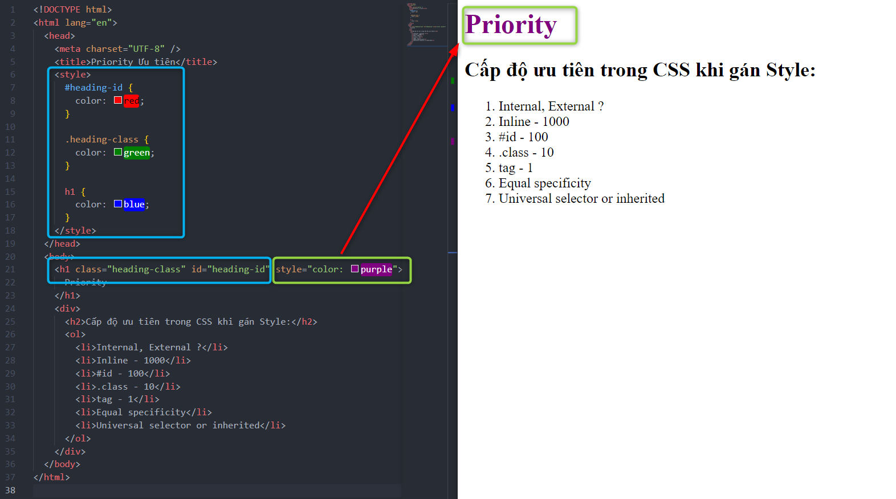

### 6. Equal specificity (Cộng gộp các khai báo)

- Khi một khai báo được xác định bởi nhiều thành phần liên tục nhau thì sẽ được ưu tiên hơn so với đối tượng cùng cấp (Có thể đặt trước hoặc sau không cần theo thứ tự, và có thể được khai báo ở trên)
- Cộng gộp các khai báo mô tả cho cùng một đối tượng.

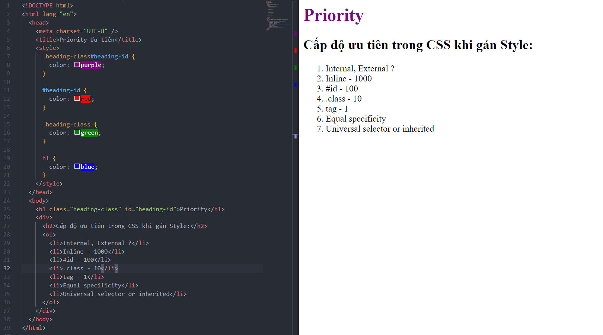
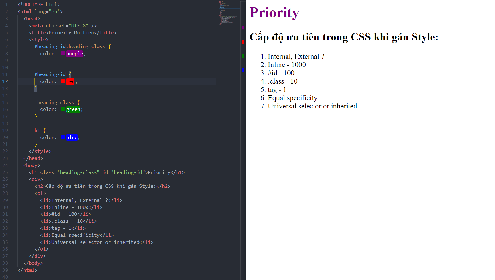
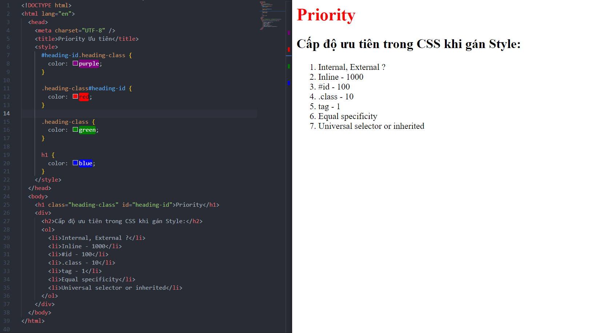

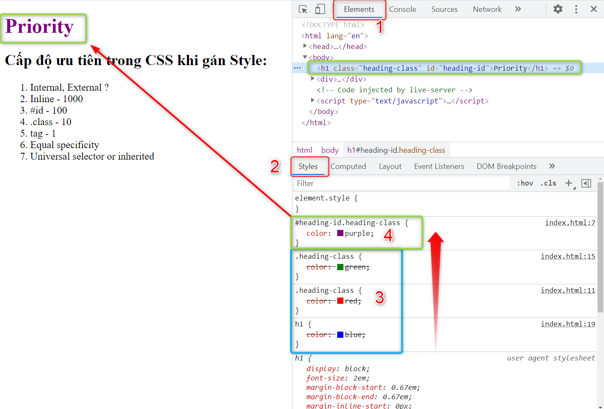

> Khi xem F12 Dev Tool theo thẻ Style của đối tượng Element Priority sẽ thấy các style được áp dụng cho đối tượng, những style nào hết hiệu lực sẽ bị gạch ngang.

### 6. Universal selector or inherited (Khai báo theo \* hoặc thẻ html)

- `Universal selector` và `inherited` có giá trị ưu tiên thấp nhất trong khai báo.
- Khai báo `inherited`: Là khai báo theo thẻ `html`

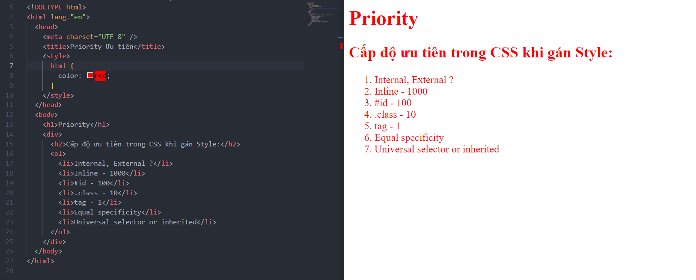

- Khai báo `Universal selector`: là khai báo `select *`

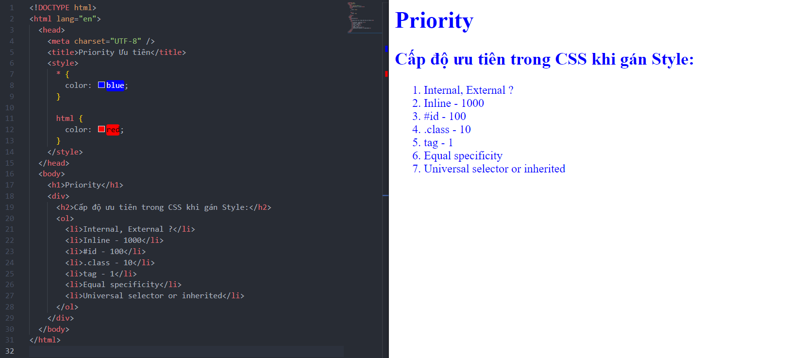

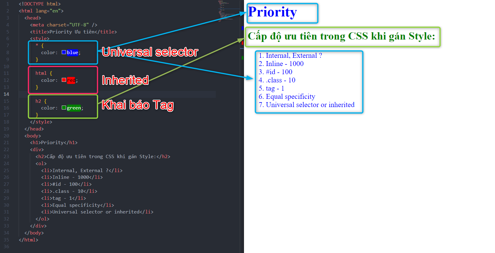

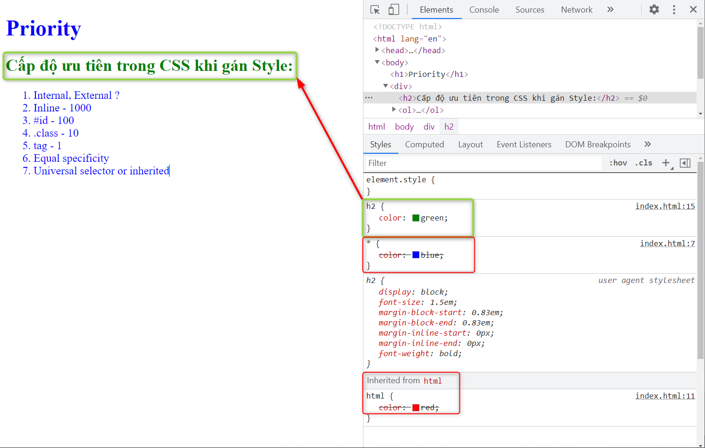

### 7. Important (Có cụm từ )

- Nếu khai báo có cụm từ `! important` thì khai báo đó sẽ được ưu tiên hơn so với các khai báo nếu không có cụm từ đó.

> Mặc dù ở h1 đã có khai báo Inline nhưng do có khai báo ! important nên độ ưu tiên sẽ cao hơn.

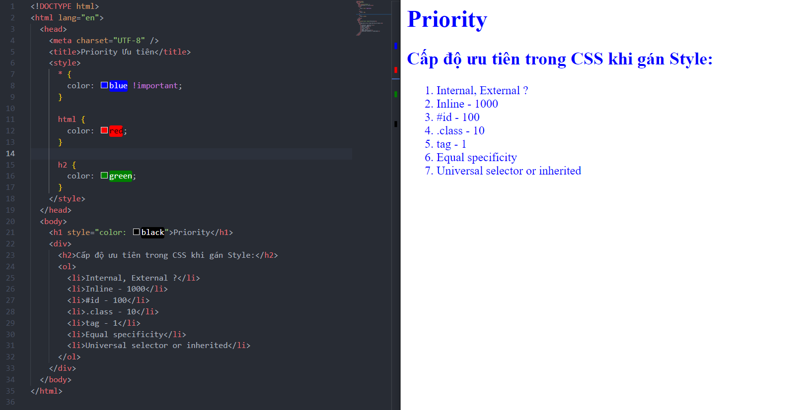

- Không có tác dụng nếu dùng cho `inherited`.

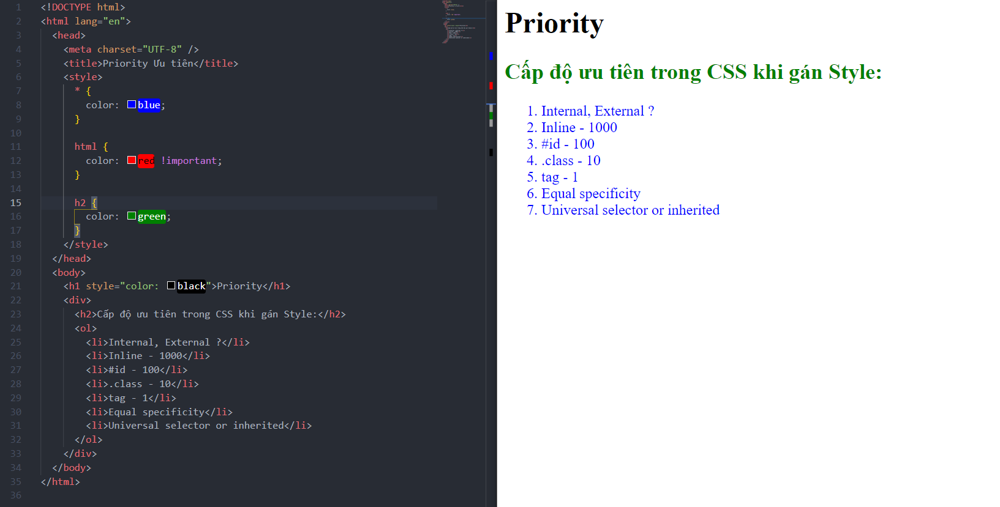
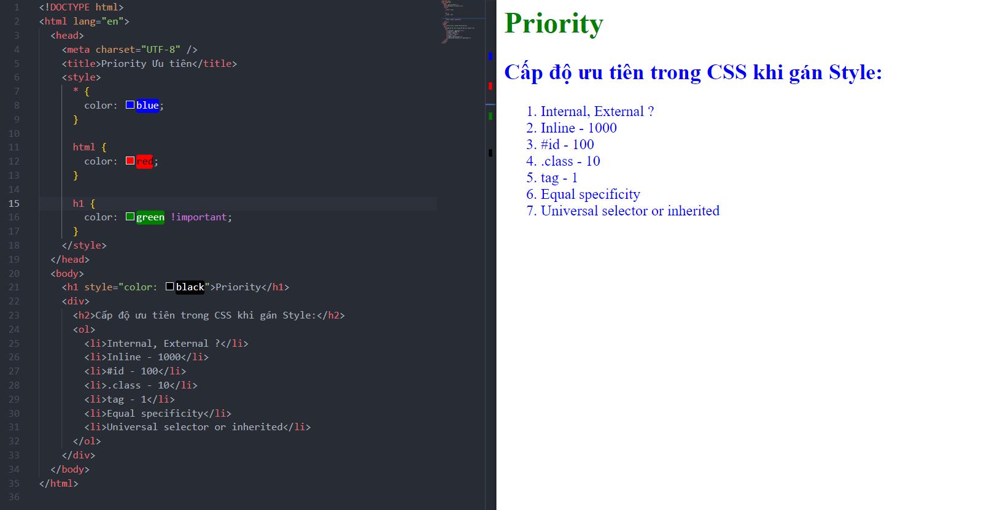

---
