# CSS Units

Các đơn vị tính trong CSS

- **`Absolute Units`**: _Đơn vị tính tuyệt đối_
  - px
  - pt
  - cm
  - mm
  - inch
  - pc
- **`Relative Units`**: _Đơn vị tính tương đối (Phụ thuộc)_
  - %
  - rem
  - em
  - vw
  - vh
  - vmin
  - vmax
  - ex
  - ch

## I. Absolute Units

---

### 1. px

- pixel : Điểm ảnh
- Đơn vị sẽ cố định số điểm ảnh cho đối tượng, khi thay đổi kéo dãn trình duyệt chiều rộng hay dài sẽ không làm thay đổi kích thước của đối tượng.

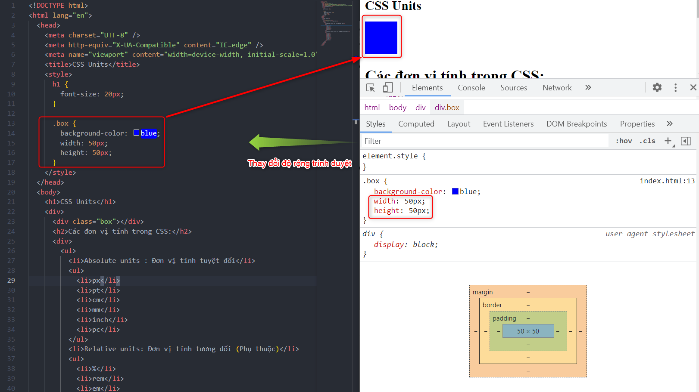
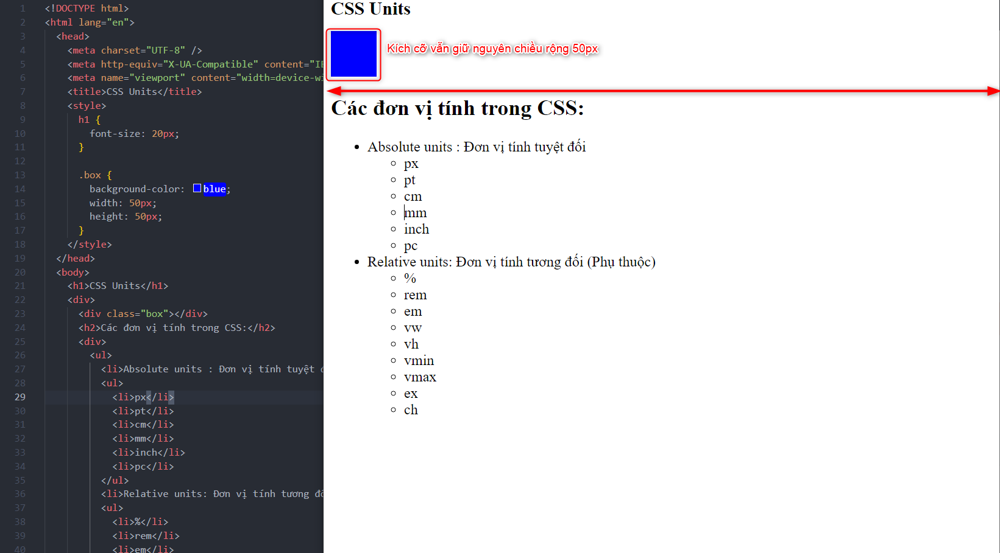

Xem thêm các đơn vị tính ở Xem [W3c css units](https://www.w3schools.com/cssref/css_units.asp).

## II. Relative Units

---

### 1. % (percent)

- Đơn vị tính tương đối sẽ được căn cứ phụ thuộc vào một đối tượng nào đó làm chuẩn, từ đó áp dụng cho đối tượng cần khai báo.
- % đơn vị tính phần trăm: sẽ được căn cứ vào khối cấp trên đang chứa đối tượng đó.
- > Ví dụ: BOX được chứa trong khối #block-id, ban đầu nếu #block-id chưa được khai báo thì BOX sẽ chịu phụ thuộc vởi khối html của trình duyệt, nhưng khi #block-id được khai báo thì sẽ căn cứ theo khối #block-id.

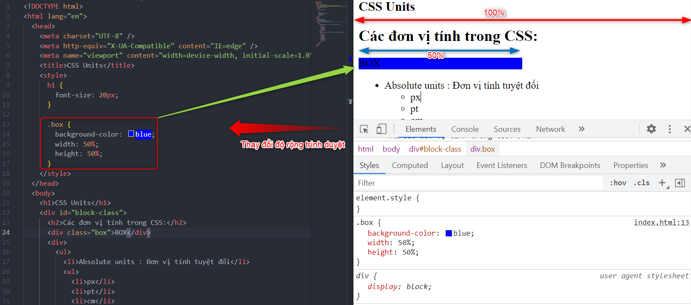
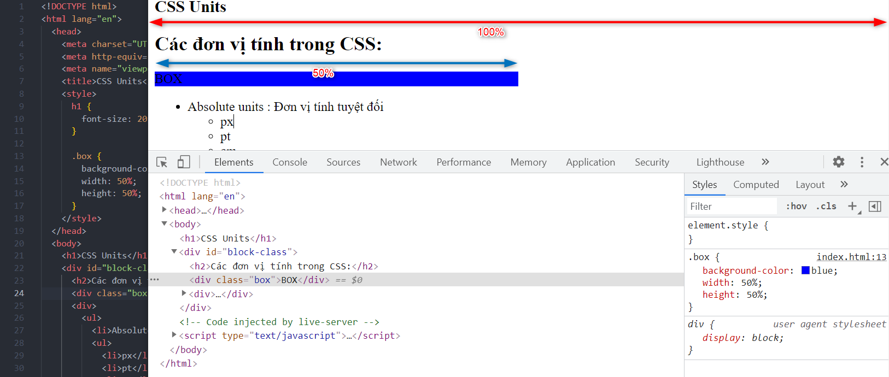

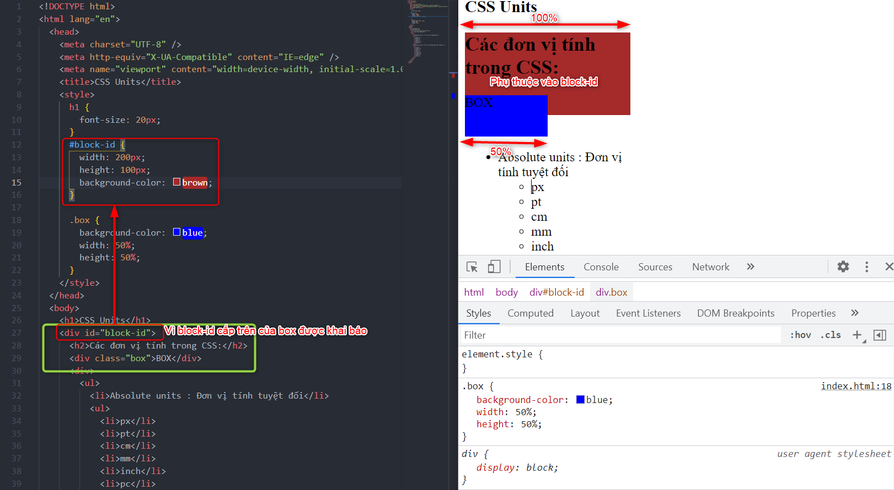
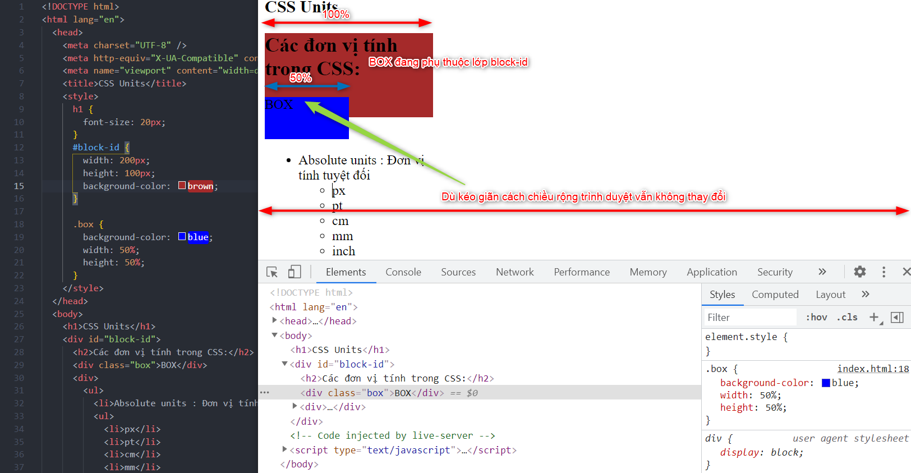

- Đơn vị tính % sẽ xét theo thứ tự phụ thuộc của kích thước khối chứa đối tượng từ thấp đến cao có chứa đối tượng được khai báo kích thước, nếu tất cả chưa được khai báo thì sẽ căn cứ vào màn hình trình duyệt là khối html.

Xem thêm ở [W3c css units](https://www.w3schools.com/cssref/css_units.asp).

### 2. rem

- Đơn vị rem sẽ chịu phụ thuộc trực tiếp bởi thẻ `html`
- 1 rem = 100% của đơn vị kích thước tương ứng của thẻ html

> Ví dụ: Ban đầu thẻ h1 có font-size là 32px, ta đổi font-size của h1 là 1rem -> 16px; mặc dù đã thay đổi thẻ body có font-size 30px, các đối tượng khác thay đổi font-size nhưng thẻ h1 vẫn không thay đổi; khi đổi thẻ html font-size thì thẻ h1 mới thay đổi theo.

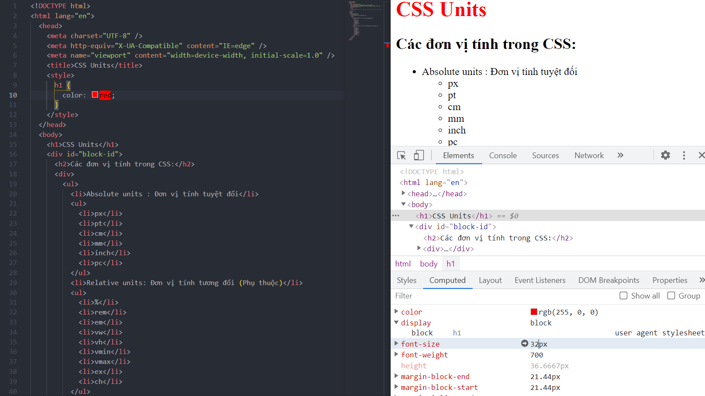
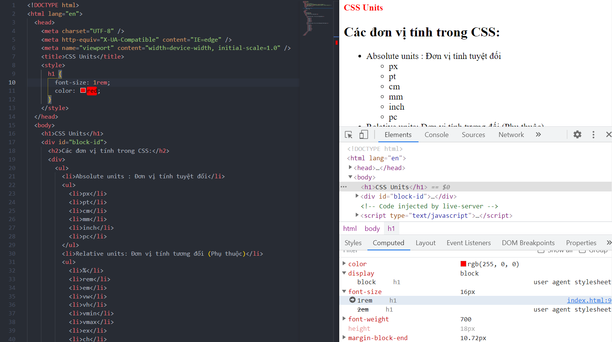
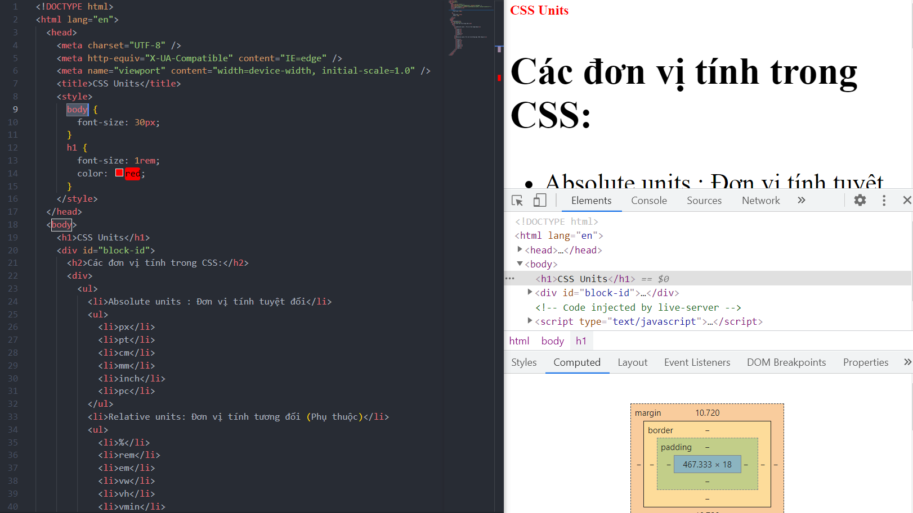
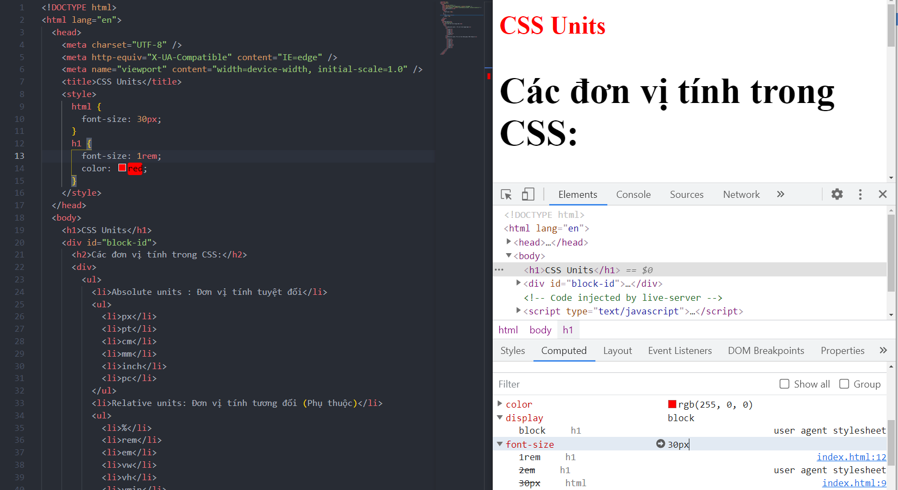
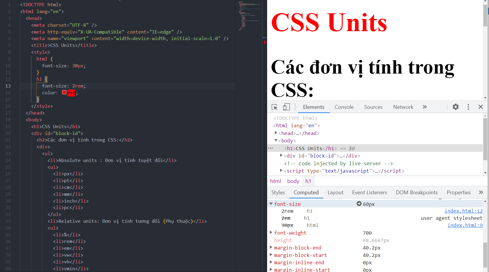

- Thực tế sẽ hay sử dụng đơn vị tính px và rem.
- Hay dùng rem vì sẽ qui về đơn vị của thẻ html.

### 3. em

- Tương tự như đơn vị %, sẽ chịu phụ thuộc của khối thẻ gần nhất chứa đối tượng đó.
-
