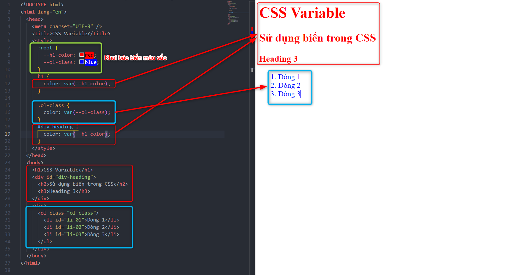
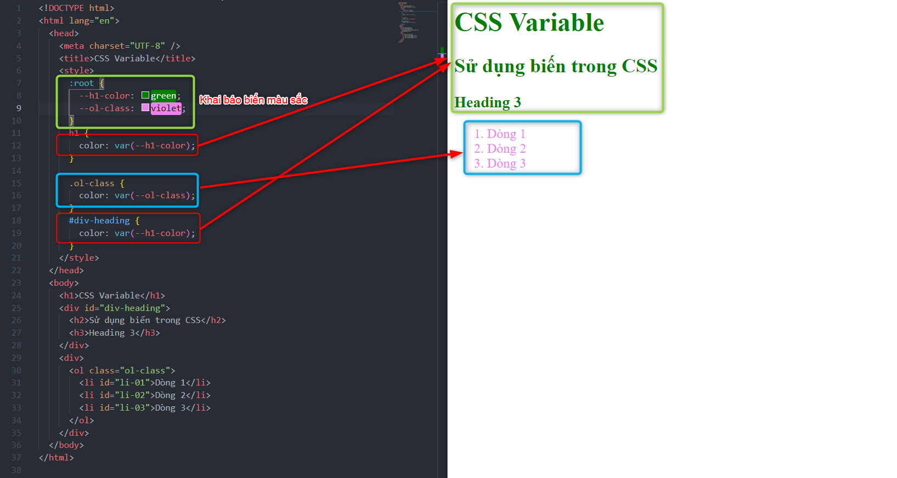
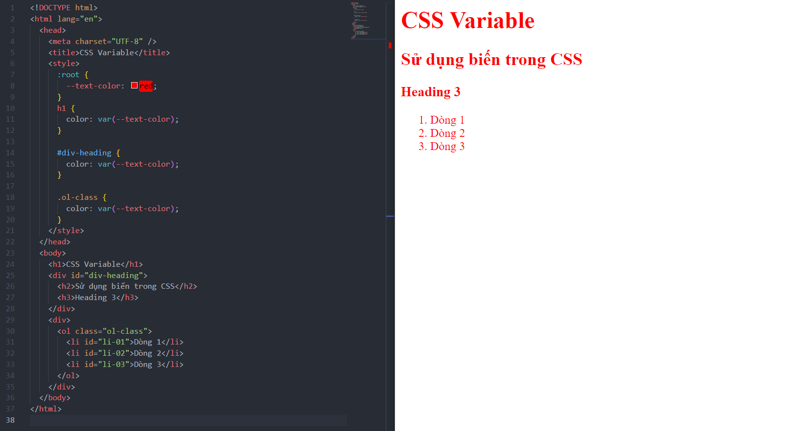
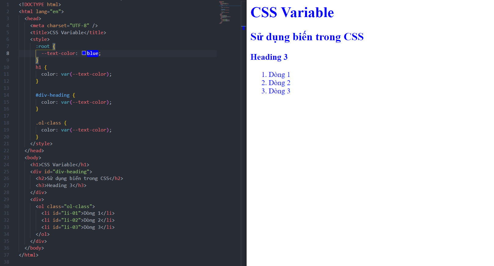
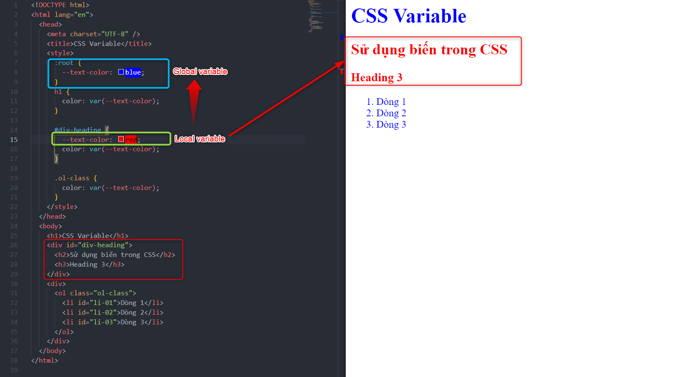

# Tìm hiểu Variable

## 1. CSS Variable (Biến)

- Sử dụng biến `variable` sẽ hỗ trợ việc gán linh hoạt các đặc tính của các phần tử.
- Khi khai báo các đặc tính của phần tử `element` thay vì khai báo trực tiếp, sẽ sử dụng gán bằng giá trị của biến `variable` đã khai báo sẵn.
- Muốn thay đổi đặc tính của `element` thay vì phải sửa từng vị trí khai báo thì chỉ cần khai báo lại đặc tính của biến `variable` được gán ở 1 nơi.

- Biến được khai báo ở `:root` được gọi là biến `Global`.
- Biến được khai báo trong 1 đối tượng nào đó sẽ là biến `Local`, một đối tượng sẽ được ưu tiên theo biến `Local` hơn so với biến `Global` khi được khai báo có biến `Local` được đặt cùng tên biến `Global`.

